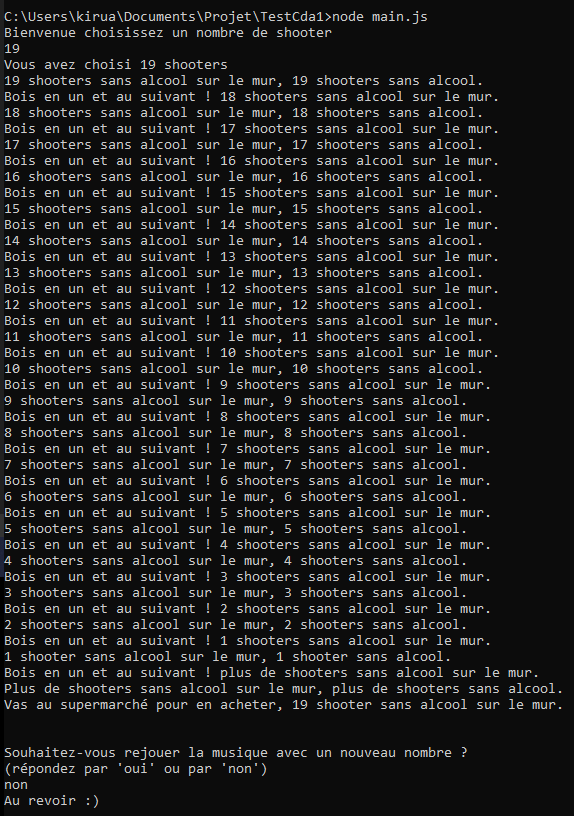

# Sans Alcool

[](https://codeclimate.com/github/yohann-kevin/sans-alcool/maintainability)

<div align="center">
    
</div>

## Documentation du projet :

### Nom du projet :

Sans alcool

### Auteur :

PERRIGUEY Yohann

### languages utilisés :

* javascript

### Description du projet :

Création d'un couplet de la musique 99 shooters pour nico ! 😃

### Démarrer le projet :

Pour commencer vous allez devoir cloné le projet via le bouton (clone or download) en haut à droite
ou via git en utilisant la commande :


```

git clone

```

Ensuite vous devrez vous rendre à la racine du projet : 


```

cd sans-alcool

```

Pour pouvoir utilisé ce programme vous devrez installez les dépendences en tapant la commande suivante : 


```

npm install

```

Une fois toutes ces étapes terminer il ne vous reste plus qu'à démarrer le projet : 


```

node main.js

```